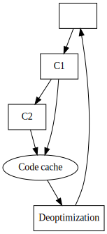
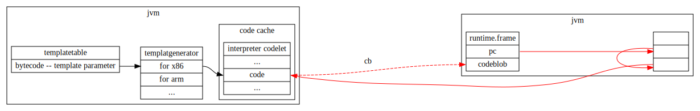
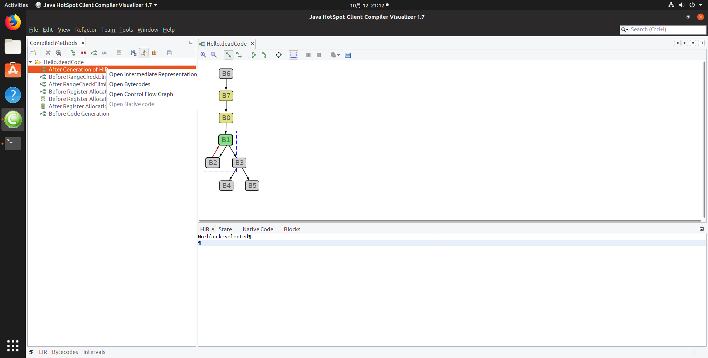

java执行过程之HIR
==========

环境准备工作
----------
工作环境ubuntu 19.04    
工作目录 ~/data/repo

安装版本工具 

下载jdk,方式1 一般都是会中断的，建议用方式二     
方式一    
<pre>
sudo hg clone http://hg.openjdk.java.net/jdk10/jdk10 jdk10_repo   
</pre> 
方式二
到官网去查看一下 revision 最大是多少 假如是 xxx ，然后用下面的命令行来下载  看下载状况设定 delta
<pre>
sudo hg clone -r 0 http://hg.openjdk.java.net/jdk10/jdk10 jdk10_repo    
cd jdk10_repo
mycount=0;step=0;delta=50; stop=xxx; while (( $mycount < $stop )); do  echo ${mycount}; sudo hg pull -r${mycount}; result=$?; if [ $result -eq 0 ]; then  step=$delta; sudo hg update; else step=0; sleep 5; fi; ((mycount=$mycount+$step)); done;
</pre>

安装编译依赖包，反正要是编译不通过，就按照提示安装
<pre>
sudo apt-get -y install systemtap-sdt-dev
sudo apt-get -y install libx11-dev libxext-dev libxrender-dev libxtst-dev libxt-dev
sudo apt-get -y install libcups2-dev
sudo apt-get -y install libfreetype6-dev
sudo apt-get -y install  libasound2-dev
sudo apt-get install libfontconfig1-dev
</pre>

编译 jdk版本
<pre>
sh configure --enable-debug --with-jvm-variants=server --enable-dtrace --with-native-debug-symbols=internal --disable-warnings-as-errors

make all
</pre>  

编译文档 doxygen + grapviz 进行文档生成  
<pre>

</pre> 

安装调试工具 gdb 和 cgdb
<pre>

</pre> 

编译c1visualizer,并运行c1visualizer
<pre>
cd ~/data/repo
git clone https://github.com/alan2lin/c1visualizer

cd c1visualizer
ant build
ant build-zip

cd dist
unzip c1visualizer-1.7.zip
cd c1visualizer
./bin/c1visualizer
</pre> 

DEMO准备工作
----------

源代码 Hello.java 带上行号
<pre>
  1 public class Hello{
  2 
  3        public static void main(String[] args) {
  4               Hello h = new Hello();
  5               h.deadCode(true);
  6        }
  7 public int deadCode(boolean flag) {
  8    int a = 24;
  9    int b = 15;  // b is deadcode
 10    int c = 5;
 11 
 12    for(int i =0;i < c;i++){
 13            a += i;
 14    }
 15 
 16    if(flag){
 17        return a + c;
 18    }else{
 19        return c;
 20    }
 21 }
 22 
 23 }
</pre>

编译  
<pre>   
~/data/repo/jdk10_repo/build/linux-x86_64-normal-server-fastdebug/jdk/bin/javac Hello.java
</pre>
字节码反向:  
<pre>  
~/data/repo/jdk10_repo/build/linux-x86_64-normal-server-fastdebug/jdk/bin/javap -l -s -v -p -c  Hello > Hello.bytecode
</pre>

字节码内容 带人肉注释

<pre>
Classfile /home/alan/data/repo/ir_demo/Hello.class
  Last modified Oct 11, 2019; size 465 bytes
  MD5 checksum 17ff4b89a61c084bb0651c330af81d4f
  Compiled from "Hello.java"
public class Hello
  minor version: 0
  major version: 53
  flags: (0x0021) ACC_PUBLIC, ACC_SUPER
  this_class: #2                          // Hello
  super_class: #5                         // java/lang/Object
  interfaces: 0, fields: 0, methods: 3, attributes: 1
Constant pool:
   #1 = Methodref          #5.#17         // java/lang/Object."<init>":()V
   #2 = Class              #18            // Hello
   #3 = Methodref          #2.#17         // Hello."<init>":()V
   #4 = Methodref          #2.#19         // Hello.deadCode:(Z)I
   #5 = Class              #20            // java/lang/Object
   #6 = Utf8               <init>
   #7 = Utf8               ()V
   #8 = Utf8               Code
   #9 = Utf8               LineNumberTable
  #10 = Utf8               main
  #11 = Utf8               ([Ljava/lang/String;)V
  #12 = Utf8               deadCode
  #13 = Utf8               (Z)I
  #14 = Utf8               StackMapTable
  #15 = Utf8               SourceFile
  #16 = Utf8               Hello.java
  #17 = NameAndType        #6:#7          // "<init>":()V
  #18 = Utf8               Hello
  #19 = NameAndType        #12:#13        // deadCode:(Z)I
  #20 = Utf8               java/lang/Object
{
  public Hello();
    descriptor: ()V
    flags: (0x0001) ACC_PUBLIC
    Code:
      stack=1, locals=1, args_size=1
         0: aload_0
         1: invokespecial #1                  // Method java/lang/Object."<init>":()V
         4: return
      LineNumberTable:
        line 1: 0

  public static void main(java.lang.String[]);
    descriptor: ([Ljava/lang/String;)V
    flags: (0x0009) ACC_PUBLIC, ACC_STATIC
    Code:
      stack=2, locals=2, args_size=1
         0: new           #2                  // class Hello
         3: dup
         4: invokespecial #3                  // Method "<init>":()V
         7: astore_1
         8: aload_1
         9: iconst_1
        10: invokevirtual #4                  // Method deadCode:(Z)I
        13: pop
        14: return
      LineNumberTable:
        line 5: 0
        line 7: 8
        line 9: 14

  public int deadCode(boolean);
    descriptor: (Z)I
    flags: (0x0001) ACC_PUBLIC
    Code:
      stack=2, locals=6, args_size=2
         0: bipush        24                  // 常量24 压入操作栈
         2: istore_2                          // 栈顶内容弹出存入第2个 slot 对应a=24 
         3: bipush        15                  // 常量15 压入操作栈
         5: istore_3                          // 栈顶内容弹出存入第3个 slot 对应b=15 
         6: iconst_5                          // 常量5 压入操作栈
         7: istore        4                   // 栈顶内容弹出存入第4个 slot 对应c=5 
         9: iconst_0                          // 常量0 压入操作栈
        10: istore        5                   // 栈顶内容弹出存入第5个 slot 对应i=0 
        12: iload         5                   // 将第5个slot的变量压入栈  也即是 i 
        14: iload         4                   // 将第4个slot的变量压入栈  也即是 c 
        16: if_icmpge     30                  // 弹出栈顶两个元素进行比较，如果i>c  则 跳转至 30行 否则下一条指令 
        19: iload_2                           // 将第2个slot的变量压入栈  也即是 a 
        20: iload         5                   // 将第5个slot的变量压入栈  也即是 i 
        22: iadd                              // 将栈顶两个元素弹出栈 并进行相加，相加结果压入栈顶 对应 stack[top]=a+i
        23: istore_2                          // 栈顶内容弹出存入第2个 slot 对应 a=a+i
        24: iinc          5, 1                // 将整形值1 增加到 第五个slot里面 对应 i++
        27: goto          12                  // 跳转至12
        30: iload_1                           // 将第2个slot的变量压入栈  也即是 flag 
        31: ifeq          39                  // 如果为0 则跳转值 39 
        34: iload_2                           // 将第2个slot的变量压入栈  也即是 a 
        35: iload         4                   // 将第4个slot的变量压入栈  也即是 c 
        37: iadd                              // 将栈顶两个元素弹出栈 并进行相加，相加结果压入栈顶 对应 stack[top]=a+c
        38: ireturn                           // 函数返回，结果在栈顶
        39: iload         4                   // 将第4个slot的变量压入栈  也即是 c 
        41: ireturn                           // 函数返回，结果在栈顶
      LineNumberTable:
        line 11: 0
        line 12: 3
        line 13: 6
        line 15: 9
        line 16: 19
        line 15: 24
        line 19: 30
        line 20: 34
        line 22: 39
      StackMapTable: number_of_entries = 3
        frame_type = 255 /* full_frame */
          offset_delta = 12
          locals = [ class Hello, int, int, int, int, int ]
          stack = []
        frame_type = 250 /* chop */
          offset_delta = 17
        frame_type = 8 /* same */

}
SourceFile: "Hello.java"
</pre>

字节码优化运行过程

先由解释器 对字节码解释执行，当jvm的采样到的数据足够出发优化的时候，将会触发优化过程，以函数为单位，进行代码块优化。
分层优化策略，c1  c2优化。

在解释器中 字节码指令  --> 本地指令的过程

在虚拟机开始的时候，会给所有的字节码指令生成 本地指令片段。为了能够跨平台，做了一层静态抽象，使用了模板和代码生成器。

用一个templatetale 映射所有的字节码 对应的代码模板，并规定了代码模板的实现接口。各个不同的平台实现再去实现这个模板的代码生成器 

生成好的代码，由codelet 进行管理，  codecache  用一堆的 codestub 队列将codelet管理起来。

在使用的时候，dispathtable 会将 指令 映射到 对应的codelet上，再取codelet里面的指令序列进行执行

字节码解释执行的过程    

frame的结构 

<pre>
 class frame VALUE_OBJ_CLASS_SPEC {
  private:
   // Instance variables:
   intptr_t* _sp; // stack pointer (from Thread::last_Java_sp)
   address   _pc; // program counter (the next instruction after the call)
  
   CodeBlob* _cb; // CodeBlob that "owns" pc
   enum deopt_state {
     not_deoptimized,
     is_deoptimized,
     unknown
   };
</pre>

如同javap 一样， 内部现对bytecode的二进制流进行解析，在jvm中是使用 
jdk10_repo/hotspot/src/share/vm/interpreter/bytecodes.cpp 中的对象进行维护，将方法的字节码解析出来，
line 80 根据 method,和bci就能取到该字节码对象，

method->code_base 是方法代码的入口地址，  bcp = code_base_address + bci  
*bcp本身 就是指令本身的内容 , 包装成 Code 对象 ，这里是一个很巧妙的实现 根据字节码的内容的值作为索引表。
Definition at line 38 of file bytecodes.hpp. 

jvm启动的时候会为所有的 字节码指令生成 一个代码模板,

根据code对象找到相应的 codelet : codelet 是将字节码对应的汇编指令模板取出来的

templatetable的位置  
jdk10_repo/hotspot/src/share/vm/interpreter/templateTable.cpp  line 260 

模板内容
<pre>
   // Java spec bytecodes                ubcp|disp|clvm|iswd  in    out   generator             argument
   def(Bytecodes::_nop                 , ____|____|____|____, vtos, vtos, nop                 ,  _           );
   def(Bytecodes::_aconst_null         , ____|____|____|____, vtos, atos, aconst_null         ,  _           );
   def(Bytecodes::_iconst_m1           , ____|____|____|____, vtos, itos, iconst              , -1           );
   def(Bytecodes::_iconst_0            , ____|____|____|____, vtos, itos, iconst              ,  0           );

 enum TosState {         // describes the tos cache contents
   btos = 0,             // byte, bool tos cached
   ztos = 1,             // byte, bool tos cached
   ctos = 2,             // char tos cached
   stos = 3,             // short tos cached
   itos = 4,             // int tos cached
   ltos = 5,             // long tos cached
   ftos = 6,             // float tos cached
   dtos = 7,             // double tos cached
   atos = 8,             // object cached
   vtos = 9,             // tos not cached
   number_of_states,
   ilgl                  // illegal state: should not occur
 };
  
</pre>

jdk10_repo/hotspot/src/share/vm/interpreter/templateTable.hpp  line 123 
<pre>
   // bytecodes
   static void nop();
  
   static void aconst_null();
   static void iconst(int value);
   static void lconst(int value);
   static void fconst(int value);
   static void dconst(int value);
</pre>

而具体的某一个平台的实现 

jdk10_repo/hotspot/src/cpu/x86/vm/templateTable_x86.cpp  line 325
<pre> 
 void TemplateTable::iconst(int value) {
   transition(vtos, itos);         // 栈顶状态的转换
   if (value == 0) {               // 如果是0 直接寄存器清零，省去一次访存操作
     __ xorl(rax, rax);
   } else {                        // 否则将常量值
     __ movl(rax, value);
   }
 }
</pre>

关于编译的阶段
-----------
编译的过程 

运行命令 查看IR信息
<pre> 
~/data/repo/jdk10_repo/build/linux-x86_64-normal-server-fastdebug/jdk/bin/java  -XX:+UnlockDiagnosticVMOptions  -XX:+PrintCFGToFile -XX:+PrintAssembly -Xcomp -XX:CompileOnly=Hello.deadCode   Hello
</pre>

运行软件，打开 *.cfg 文件直观查看  
<pre>
cd ~/data/repo/c1visualizer/dist/c1visualizer
./bin/c1visualizer
</pre>

在c1visualizer 中，打开  out_tidxxx_pidxxx.cfg 
里面则是c1编译器将字节码编译成机器代码过程中的每一个阶段的产物。
图示信息很明显。

查看HIR的图如下:

容易观测到, 前两个节点名字叫:  
name "BlockListBuilder virtual jint Hello.deadCode(jboolean)"    
name "After Generation of HIR"

第一个推测类是 blocklistbuilder，而第二个搜索一下可得到结果
<pre>

alan@alan-vb:~/data/repo/jdk10_repo/hotspot/src$ grep -rnw './' -e 'BlockListBuilder'
./share/vm/c1/c1_Instruction.hpp:1613:  // fields used by BlockListBuilder
./share/vm/c1/c1_Instruction.hpp:1614:  int            _total_preds;                   // number of predecessors found by BlockListBuilder
./share/vm/c1/c1_globals.hpp:53:          "Print block list of BlockListBuilder")                           \
./share/vm/c1/c1_GraphBuilder.cpp:44:class BlockListBuilder VALUE_OBJ_CLASS_SPEC {
./share/vm/c1/c1_GraphBuilder.cpp:89:  BlockListBuilder(Compilation* compilation, IRScope* scope, int osr_bci);
./share/vm/c1/c1_GraphBuilder.cpp:96:// Implementation of BlockListBuilder
./share/vm/c1/c1_GraphBuilder.cpp:98:BlockListBuilder::BlockListBuilder(Compilation* compilation, IRScope* scope, int osr_bci)
./share/vm/c1/c1_GraphBuilder.cpp:119:    title.print("BlockListBuilder ");
./share/vm/c1/c1_GraphBuilder.cpp:127:void BlockListBuilder::set_entries(int osr_bci) {
./share/vm/c1/c1_GraphBuilder.cpp:150:BlockBegin* BlockListBuilder::make_block_at(int cur_bci, BlockBegin* predecessor) {
./share/vm/c1/c1_GraphBuilder.cpp:176:inline void BlockListBuilder::store_one(BlockBegin* current, int local) {
./share/vm/c1/c1_GraphBuilder.cpp:179:inline void BlockListBuilder::store_two(BlockBegin* current, int local) {
./share/vm/c1/c1_GraphBuilder.cpp:185:void BlockListBuilder::handle_exceptions(BlockBegin* current, int cur_bci) {
./share/vm/c1/c1_GraphBuilder.cpp:210:void BlockListBuilder::handle_jsr(BlockBegin* current, int sr_bci, int next_bci) {
./share/vm/c1/c1_GraphBuilder.cpp:222:void BlockListBuilder::set_leaders() {
./share/vm/c1/c1_GraphBuilder.cpp:358:void BlockListBuilder::mark_loops() {
./share/vm/c1/c1_GraphBuilder.cpp:376:void BlockListBuilder::make_loop_header(BlockBegin* block) {
./share/vm/c1/c1_GraphBuilder.cpp:395:int BlockListBuilder::mark_loops(BlockBegin* block, bool in_subroutine) {
./share/vm/c1/c1_GraphBuilder.cpp:457:void BlockListBuilder::print() {
./share/vm/c1/c1_GraphBuilder.cpp:458:  tty->print("----- initial block list of BlockListBuilder for method ");
./share/vm/c1/c1_GraphBuilder.cpp:3194:  BlockListBuilder blm(compilation, scope, osr_bci);
./share/vm/c1/c1_GraphBuilder.cpp:3586:  assert(cont != NULL, "continuation must exist (BlockListBuilder starts a new block after a jsr");
./share/vm/c1/c1_GraphBuilder.cpp:3868:  // the BlockListBuilder for the callee could have bailed out
./share/vm/c1/c1_GraphBuilder.cpp:4128:  BlockListBuilder blb(compilation(), callee_scope, -1);

alan@alan-vb:~/data/repo/jdk10_repo/hotspot/src$ grep -rnw './' -e 'After Generation of HIR'
./share/vm/c1/c1_Compilation.cpp:164:    CFGPrinter::print_cfg(_hir, "After Generation of HIR", true, false);
</pre>

经过代码可以找到到最近的粗的调用点是 build_hir , 通过名字也能大致猜的的七七八八,
通过debug来追踪代码流的过程，可以选用gdb 也可以选用cgdb，我个人比较喜欢cgdb ，
cgdb ~/data/repo/jdk10_repo/build/linux-x86_64-normal-server-fastdebug/jdk/bin/java

<pre>
For help, type "help".
Type "apropos word" to search for commands related to "word"...
Reading symbols from [32m/home/alan/data/repo/jdk10_repo/build/linux-x86_64-normal-server-fastdebug/jdk/bin/java[m...
(gdb) set args -XX:+UnlockDiagnosticVMOptions  -XX:+PrintCFGToFile -XX:+PrintAssembly -Xcomp -XX:CompileOnly=Hello.deadCode   Hello
(gdb) b build_hir
Function "build_hir" not defined.
Make breakpoint pending on future shared library load? (y or [n]) y
Breakpoint 1 (build_hir) pending.
(gdb) b build_graph
Function "build_graph" not defined.
Make breakpoint pending on future shared library load? (y or [n]) y
Breakpoint 2 (build_graph) pending.
(gdb) run
</pre> 
跳过两次 segment fault 
在两个断点处进行追踪

摘取出关键的代码路径如下:

<pre>
 void Compilation::build_hir() {
     ...
     _hir = new IR(this, method(), osr_bci());  // line 154
     ...
   }

 IR::IR(Compilation* compilation, ciMethod* method, int osr_bci) :
   _num_loops(0) {
   // setup IR fields
   _compilation = compilation;
   _top_scope   = new IRScope(compilation, NULL, -1, method, osr_bci, true);  //line 269
   _code        = NULL;
 }

 IRScope::IRScope(Compilation* compilation, IRScope* caller, int caller_bci, ciMethod* method, int osr_bci, bool create_graph)
 : _callees(2)
 , _compilation(compilation)
 , _requires_phi_function(method->max_locals())
 {
  ...  
   if (create_graph && monitor_pairing_ok()) _start = build_graph(compilation, osr_bci); // line 158
 }

 // Implementation of IRScope
 BlockBegin* IRScope::build_graph(Compilation* compilation, int osr_bci) {
   GraphBuilder gm(compilation, this);
...
 }
  

GraphBuilder::GraphBuilder(Compilation* compilation, IRScope* scope)  //line 3183
   : _scope_data(NULL)
 {
   int osr_bci = compilation->osr_bci();
  
   // determine entry points and bci2block mapping
   BlockListBuilder blm(compilation, scope, osr_bci);
 ...
     }

</pre>

至此，可以从build_hir 到 cfg文件的第一段 : name "BlockListBuilder virtual jint Hello.deadCode(jboolean)"  

分析这一段函数可以得知:

<pre>
 // Implementation of BlockListBuilder
  
 BlockListBuilder::BlockListBuilder(Compilation* compilation, IRScope* scope, int osr_bci)
  : _compilation(compilation)
 {
   set_entries(osr_bci);  //设置入口块和初始化异常表的块
   set_leaders();
   CHECK_BAILOUT();
  
   mark_loops();
   NOT_PRODUCT(if (PrintInitialBlockList) print());
 }

 void BlockListBuilder::set_entries(int osr_bci) {
   // generate start blocks
   BlockBegin* std_entry = make_block_at(0, NULL); //产生或者获取首块，但为什么每一个指令都要去检查首块?
   if (scope()->caller() == NULL) {  //这段代码会不会有有冗余? 每一个指令都会判断一次？哪里会影响scope么?
     std_entry->set(BlockBegin::std_entry_flag);   
   }
   if (osr_bci != -1) {
     BlockBegin* osr_entry = make_block_at(osr_bci, NULL);
     osr_entry->set(BlockBegin::osr_entry_flag);
   }
  
   // generate exception entry blocks  //为异常产生block
   XHandlers* list = xhandlers();
   const int n = list->length();
   for (int i = 0; i < n; i++) {
     XHandler* h = list->handler_at(i);
     BlockBegin* entry = make_block_at(h->handler_bci(), NULL);
     entry->set(BlockBegin::exception_entry_flag);
     h->set_entry_block(entry);
   }
 }
  

 BlockBegin* BlockListBuilder::make_block_at(int cur_bci, BlockBegin* predecessor) {
   assert(method()->bci_block_start().at(cur_bci), "wrong block starts of MethodLivenessAnalyzer");
  
   BlockBegin* block = _bci2block->at(cur_bci);  //获取bci对应的block
   if (block == NULL) {                          //如果没有则创建
     block = new BlockBegin(cur_bci);
     block->init_stores_to_locals(method()->max_locals());
     _bci2block->at_put(cur_bci, block);
     _blocks.append(block);
  
     assert(predecessor == NULL || predecessor->bci() < cur_bci, "targets for backward branches must already exist");
   }
  
   if (predecessor != NULL) {  //如果有前驱节点，则将当前模块加入到前驱里面去。
     if (block->is_set(BlockBegin::exception_entry_flag)) {
       BAILOUT_("Exception handler can be reached by both normal and exceptional control flow", block);
     }
  
     predecessor->add_successor(block);
     block->increment_total_preds();
   }
  
   return block;
 }

void BlockListBuilder::set_leaders() {
   bool has_xhandlers = xhandlers()->has_handlers();
   BlockBegin* current = NULL;
  
   // The information which bci starts a new block simplifies the analysis
   // Without it, backward branches could jump to a bci where no block was created
   // during bytecode iteration. This would require the creation of a new block at the
   // branch target and a modification of the successor lists.
   const BitMap& bci_block_start = method()->bci_block_start();
  
   ciBytecodeStream s(method());  //将方法转换成字节码流 
   while (s.next() != ciBytecodeStream::EOBC()) {
     int cur_bci = s.cur_bci();  //逐一遍历 
  
     if (bci_block_start.at(cur_bci)) {  //获取当前块
       current = make_block_at(cur_bci, current);
     }
     assert(current != NULL, "must have current block");
  
     if (has_xhandlers && GraphBuilder::can_trap(method(), s.cur_bc())) {
       handle_exceptions(current, cur_bci);
     }
  
     switch (s.cur_bc()) {  //根据指令进行判断   
       // track stores to local variables for selective creation of phi functions
       case Bytecodes::_iinc:     store_one(current, s.get_index()); break;  //当前指令会变更 index 的变量的值。 storeone是只会影响一个字长的。 
       case Bytecodes::_istore:   store_one(current, s.get_index()); break;
       case Bytecodes::_lstore:   store_two(current, s.get_index()); break;
       case Bytecodes::_fstore:   store_one(current, s.get_index()); break;
       case Bytecodes::_dstore:   store_two(current, s.get_index()); break;
       case Bytecodes::_astore:   store_one(current, s.get_index()); break;
       case Bytecodes::_istore_0: store_one(current, 0); break;   
       case Bytecodes::_istore_1: store_one(current, 1); break;
       case Bytecodes::_istore_2: store_one(current, 2); break;
       case Bytecodes::_istore_3: store_one(current, 3); break;
       case Bytecodes::_lstore_0: store_two(current, 0); break;  //这里的index是固定的，但是store_two是两个字长
       case Bytecodes::_lstore_1: store_two(current, 1); break;
       case Bytecodes::_lstore_2: store_two(current, 2); break;
       case Bytecodes::_lstore_3: store_two(current, 3); break;
       case Bytecodes::_fstore_0: store_one(current, 0); break;
       case Bytecodes::_fstore_1: store_one(current, 1); break;
       case Bytecodes::_fstore_2: store_one(current, 2); break;
       case Bytecodes::_fstore_3: store_one(current, 3); break;
       case Bytecodes::_dstore_0: store_two(current, 0); break;
       case Bytecodes::_dstore_1: store_two(current, 1); break;
       case Bytecodes::_dstore_2: store_two(current, 2); break;
       case Bytecodes::_dstore_3: store_two(current, 3); break;
       case Bytecodes::_astore_0: store_one(current, 0); break;
       case Bytecodes::_astore_1: store_one(current, 1); break;
       case Bytecodes::_astore_2: store_one(current, 2); break;
       case Bytecodes::_astore_3: store_one(current, 3); break;
  
       // track bytecodes that affect the control flow    //跳出方法体的，异常或者返回，已经脱离控制流程的，当前块被清空
       case Bytecodes::_athrow:  // fall through
       case Bytecodes::_ret:     // fall through
       case Bytecodes::_ireturn: // fall through
       case Bytecodes::_lreturn: // fall through
       case Bytecodes::_freturn: // fall through
       case Bytecodes::_dreturn: // fall through
       case Bytecodes::_areturn: // fall through
       case Bytecodes::_return:
         current = NULL;
         break;
  
       case Bytecodes::_ifeq:      // fall through
       case Bytecodes::_ifne:      // fall through
       case Bytecodes::_iflt:      // fall through
       case Bytecodes::_ifge:      // fall through
       case Bytecodes::_ifgt:      // fall through
       case Bytecodes::_ifle:      // fall through
       case Bytecodes::_if_icmpeq: // fall through
       case Bytecodes::_if_icmpne: // fall through
       case Bytecodes::_if_icmplt: // fall through
       case Bytecodes::_if_icmpge: // fall through
       case Bytecodes::_if_icmpgt: // fall through
       case Bytecodes::_if_icmple: // fall through
       case Bytecodes::_if_acmpeq: // fall through
       case Bytecodes::_if_acmpne: // fall through
       case Bytecodes::_ifnull:    // fall through
       case Bytecodes::_ifnonnull:                    //条件语句为分叉跳转语句，则在分叉口 劈出两块，下一个指令为起点和目标指令为起点
         make_block_at(s.next_bci(), current);
         make_block_at(s.get_dest(), current);
         current = NULL;
         break;
  
       case Bytecodes::_goto:                      //强跳直接在目标建立块
         make_block_at(s.get_dest(), current);
         current = NULL;
         break;
  
       case Bytecodes::_goto_w:
         make_block_at(s.get_far_dest(), current);
         current = NULL;
         break;
  
       case Bytecodes::_jsr:    //段落跳转  jsr+ret 实现finally的 老版本的方法。
         handle_jsr(current, s.get_dest(), s.next_bci());
         current = NULL;
         break;
  
       case Bytecodes::_jsr_w:
         handle_jsr(current, s.get_far_dest(), s.next_bci());
         current = NULL;
         break;
  
       case Bytecodes::_tableswitch: {   // switch case方法  查表法 适用于连续的index
         // set block for each case
         Bytecode_tableswitch sw(&s);
         int l = sw.length();
         for (int i = 0; i < l; i++) {
           make_block_at(cur_bci + sw.dest_offset_at(i), current);
         }
         make_block_at(cur_bci + sw.default_offset(), current);
         current = NULL;
         break;
       }
  
       case Bytecodes::_lookupswitch: {   //switch case的 查找法，适用于离散的index
         // set block for each case
         Bytecode_lookupswitch sw(&s);
         int l = sw.number_of_pairs();
         for (int i = 0; i < l; i++) {
           make_block_at(cur_bci + sw.pair_at(i).offset(), current);
         }
         make_block_at(cur_bci + sw.default_offset(), current);
         current = NULL;
         break;
       }
  
       default:
         break;
     }
   }
 }

 void BlockListBuilder::mark_loops() {    //标记循环块
   ResourceMark rm;
  
   _active.initialize(BlockBegin::number_of_blocks());    // ？？
   _visited.initialize(BlockBegin::number_of_blocks());   //到访的标记
   _loop_map = intArray(BlockBegin::number_of_blocks(), BlockBegin::number_of_blocks(), 0); //存储什么的?
   _next_loop_index = 0;
   _next_block_number = _blocks.length();
  
   // recursively iterate the control flow graph
   mark_loops(_bci2block->at(0), false);   //递归处理控制流程
   ....
 }
  
 void BlockListBuilder::make_loop_header(BlockBegin* block) {
   if (block->is_set(BlockBegin::exception_entry_flag)) {  // 异常也符合 actived 和 visited的要求，但是不能标记为循环。
     // exception edges may look like loops but don't mark them as such
     // since it screws up block ordering.
     return;
   }
   if (!block->is_set(BlockBegin::parser_loop_header_flag)) {  
     block->set(BlockBegin::parser_loop_header_flag);
  
     assert(_loop_map.at(block->block_id()) == 0, "must not be set yet");
     assert(0 <= _next_loop_index && _next_loop_index < BitsPerInt, "_next_loop_index is used as a bit-index in integer");
     _loop_map.at_put(block->block_id(), 1 << _next_loop_index);  //在该块的id的对应位置，存如下一个索引值的两倍，用这个来做简单的校验。 
     if (_next_loop_index < 31) _next_loop_index++;  //如果小于 31 ，下一个索引值增加。
   } else {
     // block already marked as loop header
     assert(is_power_of_2((unsigned int)_loop_map.at(block->block_id())), "exactly one bit must be set"); //如果block没有这是标记，但是里面的值却是2的倍数则意味着出错了。
   }
 }
  
 int BlockListBuilder::mark_loops(BlockBegin* block, bool in_subroutine) {
   int block_id = block->block_id();   
  
   if (_visited.at(block_id)) {  //出口，如果是回边则是出口。
     if (_active.at(block_id)) {
       // reached block via backward branch   
       make_loop_header(block);
     }
     // return cached loop information for this block  
     return _loop_map.at(block_id);
   }
  
   if (block->is_set(BlockBegin::subroutine_entry_flag)) { 
     in_subroutine = true;
   }
  
   // set active and visited bits before successors are processed
   _visited.set_bit(block_id);
   _active.set_bit(block_id);
  
   intptr_t loop_state = 0;   //递归遍历所有的 后继块。
   for (int i = block->number_of_sux() - 1; i >= 0; i--) {
     // recursively process all successors
     loop_state |= mark_loops(block->sux_at(i), in_subroutine);
   }

  
   // clear active-bit after all successors are processed   //为什么要清除?
   _active.clear_bit(block_id);
  
   // reverse-post-order numbering of all blocks  //反向标记顺序 ？
   block->set_depth_first_number(_next_block_number);
   _next_block_number--;
  
   if (loop_state != 0 || in_subroutine ) { //根据loopstate来判断 是否需要phi函数 S
     // block is contained at least in one loop, so phi functions are necessary
     // phi functions are also necessary for all locals stored in a subroutine
     scope()->requires_phi_function().set_union(block->stores_to_locals());
   }
  
   if (block->is_set(BlockBegin::parser_loop_header_flag)) {
     int header_loop_state = _loop_map.at(block_id); //如果
     assert(is_power_of_2((unsigned)header_loop_state), "exactly one bit must be set");
  
     // If the highest bit is set (i.e. when integer value is negative), the method
     // has 32 or more loops. This bit is never cleared because it is used for multiple loops
     if (header_loop_state >= 0) {
       clear_bits(loop_state, header_loop_state);
     }
   }
  
   // cache and return loop information for this block
   _loop_map.at_put(block_id, loop_state);
   return loop_state;
 }
  
</pre>

理论上这个过程大致过程如下: 

    

 

