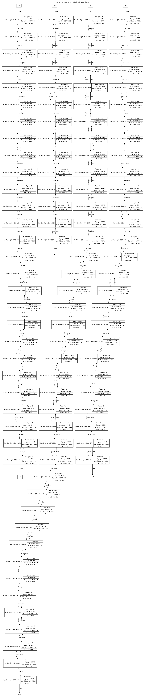

!32  netty 5 内存泄漏分析!

# 前言
  2020年3月份的时候，某使用了netty5的服务器出现内存泄露， 进行了友情支援，花了两三天分析了netty 5的源码和设计。梳理了这份文档，对netty5的内存泄露的排查做了一个一般性的总结。
本文方法也适用于 netty4 ，但需要根据netty4的源码进行重新梳理。 

#0. 约定: 
文中的所有图片皆采用graphviz/mscgen 渲染文本而成。 具体使用命令:
生成高清无码版:
` dot -Tsvg -o target.svg target.dot `
如:
` dot -Tsvg -o runtime_memory_layout.svg runtime_memory_layout.dot `
生成 png格式版,为了显示较高清晰度使用了  dpi=300 
` dot -Gdpi=300 -Tpng -o target.svg target.dot `
由于这里不支持svg的图片格式， 所以生成了png的格式，如果想看高清图，自行安装软件渲染。

消息交互图的生成命令 ,无dpi的参数。
`mscgen -Tsvg  target.msc`
`mscgen -Tpng  target.msc`


#1.  背景
---
在生产上的netty5。0.0.Alpha2 存在内存泄露，经监控发现是 direct 区爆表引发的oom， 
oom时的堆栈如下:
```java
java.lang.OutOfMemoryError: Direct buffer memory
        at java.nio.Bits.reserveMemory(Bits.java:694)
        at java.nio.DirectByteBuffer.<init>(DirectByteBuffer.java:123)
        at java.nio.ByteBuffer.allocateDirect(ByteBuffer.java:311)
        at io.netty.buffer.PoolArena$DirectArena.newChunk(PoolArena.java:437)
        at io.netty.buffer.PoolArena.allocateNormal(PoolArena.java:179)
        at io.netty.buffer.PoolArena.allocate(PoolArena.java:168)
        at io.netty.buffer.PoolArena.allocate(PoolArena.java:98)
        at io.netty.buffer.PooledByteBufAllocator.newDirectBuffer(PooledByteBufAllocator.java:241)
        at io.netty.buffer.AbstractByteBufAllocator.directBuffer(AbstractByteBufAllocator.java:155)
        at io.netty.buffer.AbstractByteBufAllocator.directBuffer(AbstractByteBufAllocator.java:146)
        at io.netty.buffer.AbstractByteBufAllocator.ioBuffer(AbstractByteBufAllocator.java:107)
        at io.netty.channel.AdaptiveRecvByteBufAllocator$HandleImpl.allocate(AdaptiveRecvByteBufAllocator.java:104)
        at io.netty.channel.nio.AbstractNioByteChannel$NioByteUnsafe.read(AbstractNioByteChannel.java:113)
        at io.netty.channel.nio.NioEventLoop.processSelectedKey(NioEventLoop.java:514)
        at io.netty.channel.nio.NioEventLoop.processSelectedKeysOptimized(NioEventLoop.java:471)
        at io.netty.channel.nio.NioEventLoop.processSelectedKeys(NioEventLoop.java:385)
        at io.netty.channel.nio.NioEventLoop.run(NioEventLoop.java:351)
        at io.netty.util.concurrent.SingleThreadEventExecutor$2.run(SingleThreadEventExecutor.java:116)
        at io.netty.util.internal.chmv8.ForkJoinTask$RunnableExecuteAction.exec(ForkJoinTask.java:1412)
        at io.netty.util.internal.chmv8.ForkJoinTask.doExec(ForkJoinTask.java:280)
        at io.netty.util.internal.chmv8.ForkJoinPool$WorkQueue.runTask(ForkJoinPool.java:877)
        at io.netty.util.internal.chmv8.ForkJoinPool.scan(ForkJoinPool.java:1706)
        at io.netty.util.internal.chmv8.ForkJoinPool.runWorker(ForkJoinPool.java:1661)
        at io.netty.util.internal.chmv8.ForkJoinWorkerThread.run(ForkJoinWorkerThread.java:126
```


#2.  分析思路:
---
一般使用自管理的内存池 发生内存泄漏 ，可以归为两大类，
- 一大类是 有可用内存但是由于分配算法错误导致额外申请内存，这种情况一般是发生在分配时。 
- 一大类是 实际上已经无可用内存了，需要申请内存。这种情况下一般是归还或者清理算法有问题。
由于运行时的动态信息已经无法捕捉，所以只能从内存布局上结合源代码进行分析。

#3. 处理过程方法论
---
1. 导出现场数据:  coredump 出jvm: 在生产环境运行  jmap -dump:format=b,file=xx [pid]  导出coredump文件。
2. 搭建分析环境: 在本地机器上  运行 jhat -J-d64 -J-mx16g -port 8000 xx  然后通过浏览器进行访问。
3. 通过源代码粗略了解netty的内存管理机制：理清 poolchunklist ，poolchunk， arena，page等类的关系，内存申请，使用，释放过程。
4. 合理猜测并求证： 通过 Object Query Language (OQL) query 语言查询出相关的对象信息，并用graphviz 将内存数据描述出来。查看数据并作出合理假设，再通过代码review或者debug进行求证。


#4. 通过源代码了解内存布局与相关机制
---
netty 使用内存池来管理内存， 在默认配置下，  poolchunk 来管理实际的物理内存的元信息，netty 会以 以16m为单位来申请内存，绑定到 poolchunk.memory 上。
netty 将chunk进行归类， 按照 使用容量比等分成4份，5个队列。在使用过程中根据具体的使用情况动态移动chunk到对应的 chunklist。

对于池化内存， netty通过 PooledByteBuf 来使用内存， 需要使用内存时 ，创建一个 PooledByteBuf 对象， 并视请求分配的大小进行分配。 小于 512 的对象优先到tiny和 small的cache中分配，大于512小于chunksize=16m的内存 在池中分配，大于 chunksize的数据不使用内存池管理。

PooledByteBuf 的使用过程使用引用计数进行追踪，release时并不一定归还内存到池里，只有引用计数为0时才会归还。


##4.1 代码中的内存布局
---
对于每一个 poolarena,都有tiny和small两个内存池，使用数组的方式进行存储 一个 chunklist 的双向列表。 以及在全局分配器中为每一个线程保留两个page cache ，tiny和small。

具体关系 见图， 

高清无码版执行命令:
` dot -Tsvg -o runtime_memory_layout.svg runtime_memory_layout.dot `


##4.2 内存申请过程
---
参见时序图，大约流程是 使用者会跟 PooledByteBufAllocator 申请一块内存。PooledByteBufAllocator 将请求转发给 本线程的 类似管程角色的  threadCache.directArena ,threadCache.directArena 从 垃圾回收器里 找个 PooledUnsafeDirectByteBuf 的应用回来重用，如果是小对象(小于512)，优先从缓存池里面申请，如果是超过chunk大小(16m)的对象 则不经过池申请，其余的在常规池申请。
缓存池的优点是不需要经过很多次查找就能够分配。常规池至少要经过 depth的次数的查找。    
在常规池申请的时候 会在chunklist 里面查找，如果找到合适的，就在chunk里面申请内存，并根据使用后的usage调整该chunk所在的队列。
如果找不到合适的，就新申请一块chunk。   
拿到chunk后 ，就在chunk里面申请需要的大小，注意，这个大小跟页对齐。然后添加到 qinit的 chunklist里面。

执行命令可见高清图:
`mscgen -Tsvg  alloc_process.msc`


##4.3 内存分配算法过程
---

```java
    /**
     * Algorithm to allocate an index in memoryMap when we query for a free node
     * at depth d
     *  算法的思想 
     *  从结构上来说，每一层的节点 都是按照 2的n次方大小进行划分的位图。n=最大层次数-所在的层次数， 层数越高，块越大。
     *  最高那一层 是 整个块。最低那一层是一个pagesize的大小。 memorymap 存放的是分配状况，每一个层节点存放的是它管辖方位内，
     * 还能连续分配的最大max_size，这个size是通过公式变换为跟深度相关的值。value = maxorders - log2(max_size) 。 
     * 这个值跟depth 是一个含义。其值越大，能分配的连续块大小越小。
     * 
     * 算法自上而下的迭代，  先对最顶层做判断 顶层的数值的value 如， 确保一定存在可分配的块。 然后下沉到第d层，
     * 每一层只做一次判断， 如果左节点不够分配，则到右节点中找。
     * 这个算法确保在d次就能找到一块合适的内存。
     * @param d depth  
     * @return index in memoryMap
     */
    private int allocateNode(int d) { 
        int id = 1;    //memorymap 的存储是从1 开始的。 所以这个是根节点的坐标。
        int initial = - (1 << d); // has last d bits = 0 and rest all = 1  //把  00001000 的形式转换成 11111000 便于位操作。 
        byte val = value(id);    //先判断根节点 是否可用，如果 根位置的值大于 d 则意味着 该chunk的最大连续内存不足满足需求。
        if (val > d) { // unusable
            return -1;
        }
		// 从根节点开始，以层次遍历的方式自顶下向下 判断根节点。
		// (id & initial) == 0) 可以确保 在小于d层的时候，无条件执行，在d层以及以下，
		// 才转由结果值来判断，但由于d层以下的节点其值都会大于 d，所以这个循环会到d层后停止。
        // 可以理解为 每一跳一层，如果落掉点没有可以分配的，就跑到右边去，然后继续跳。
        while (val < d || (id & initial) == 0) { // id & initial == 1 << d for all ids at depth d, for < d it is 0
            id <<= 1;    // 移动到下一层
            val = value(id);   
            if (val > d) {    //如果左节点不够分配， 则跳到右节点。
                id ^= 1;
                val = value(id);
            }
        }
		//程序执行到这里，基本可以确认一定会在d层命中一个可分配的节点。
        byte value = value(id);
        assert value == d && (id & initial) == 1 << d : String.format("val = %d, id & initial = %d, d = %d",
                value, id & initial, d);
        setValue(id, unusable); // mark as unusable  
        updateParentsAlloc(id);  //更新父节点的状态。 取子节点的最小值
        return id;
    }

```
执行命令可以得高清无码大图
一次申请 2个page的算法图示。
` dot -Tpng -o buddy_allocator.png buddy_allocator.dot`


##4.4 内存使用的过程
---
池化的内存都通过 PooledDirectByteBuf 对象来进行引用。
PooledDirectByteBuf继承结构如图:

其中比较重要的是  关于引用计数器的那块。


##4.5 内存回收和释放的过程
---
池化的内存都通过 PooledDirectByteBuf   对象来进行引用。其抽象类 PooledByteBuf 是统一的接口。
这个引用统一由 recycler 分发，确保每一个 PooledByteBuf 都会捆绑一个 Recycler.Handle ，
应用通过  PooledByteBuf.retain 来增加引用计数，在不需要的时候， 通过 release来释放引用计数。
当 引用计数为 0 的时候 ，release 过程会调用  deallocate 方法， 并调用arena.free(chunk,handle)归还内存到chunk(会优先放置到缓存，如果缓存超过阈值8192就会清空缓存)，
最后调用 recycle()方法，将Recycler.Handle 丢到回收站， 以便循环利用，减少创建的开销。
如图 


内存泄露检测过程
AbstractByteBufAllocator 在分配的缓存的时候， 一般都会调用 toLeakAwareBuffer 将缓存包装成 可感知泄露的缓存。
具体原理机制如下: 分配器将缓存对象提交给  泄露检测器  ResourceLeakDetector ，
检测器 有三种配置，
- SIMPLE 简单采样 ，每隔samplingInterval=113 就采样一次。同时输出当时内存泄漏状况,但不创建额外的记录信息。
- ADVANCED 高级采样，采样频率同 SIMPLE，不同的是创建额外的 对象建立时的堆栈信息。 
- PARANOID  激进采样， 相对于ADVANCED ，采样率为 100%。

泄露检测器  ResourceLeakDetector 会为每一次采样创建一个 泄露检测子:DefaultResourceLeak。
 DefaultResourceLeak 是一个 幽灵引用(PhantomReference)。在创建时 会加入 一个head所在的活动列表，以及注册到一个幽灵引用队列refqueue。
 当该leak资源被gc回收时， 能在refqueue中读取到该leak，然后检测器再将其从head所在的活动队列中移除，如果移除时发现freed已经是true，则返回失败，则认为该资源还在活动列表就被gc回收了， 存在泄露。


##4.6 堆外内存的使用机制
---
这一块并不是问题的根源， 不重要，简单地梳理一下是:
jvm的堆外内存 是使用 DirectBuffer 进行管理的，每一个 DirectBuffer 都会绑定一个对应的 cleaner。 
当DirectBuffer 被回收的时候 会执行cleaner的清除方法来释放内存。

#5 收集基本信息，做出假设并求证
---


##5.1 是分配的时候出问题还是归还的时候出问题？
所有首先要看看有多少chunk，以及chunk的使用情况。
查看poolchunk的占用状况:

计算最后一层，将每个page的使用情况计算出来。需要算出 页数，需要算出最后一层的页的使用情况。

chunk明细情况:
```java
select {chunk:s,chunksize:s.chunkSize,memmap:s.memoryMap,memmapsize:s.memoryMap.length,
depthmap:s.depthMap,depthmapsize:s.depthMap.length,maxorder:s.maxOrder,pagesize:s.pageSize,
pages: s.chunkSize/s.pageSize,pageusage:sum(map(s.memoryMap," (index>array.length/2 -1?1:0)*(it==12?1:0)"))
}  from io.netty.buffer.PoolChunk s
```
107个chunk几乎都被用光了。

chunk剩余情况:
```java
select s from io.netty.buffer.PoolChunk s 
where sum(map(s.memoryMap," (index>array.length/2 -1?1:0)*(it==12?1:0)"))< s.chunkSize/s.pageSize
```
只有一个chunk还剩下两个page
io.netty.buffer.PoolChunk@0x8781dfa  

因此可以判断出，不是分配算法出了问题而是归还算法出了问题。

##5.2 为什么不归还? 
根据 4.x 可以知道， 如果是内存一直被耗用着， 那么 PooledByteBuf 及其子类应该会有很多的实例。
于是我们可以查看一下，相关的实例的情况。
查看明细
` select  heap.objects("io.netty.buffer.PooledByteBuf", true) `
或者查看汇总值
` select count( heap.objects("io.netty.buffer.PooledByteBuf", true) )`
50个
统计一下其所占用的内存大小
`select  sum( map(heap.objects("io.netty.buffer.PooledByteBuf", true),"it.length" ) ) `
才  41783.0  ,大约  41k 左右。

统计其占用的chunk数量
` select  count ( unique( map(heap.objects("io.netty.buffer.PooledByteBuf", true),"it.chunk" )  ) ) `
有 9 个。
其中 还有一个 chunk为null的也有.
`select  count (heap.objects("io.netty.buffer.PooledByteBuf", true,"it.chunk==null")  )`

总的来说，PooledByteBuf 的子类实例的占用并不多。 

再看一下 recycleHandle 的实例状况 
` select  count( heap.objects("io.netty.util.Recycler$DefaultHandle",true) ) `
有 2716 个 ,从刚才的原理里面我们知道 这个基本是不回收的。

再追踪一下 
`select unique(map(heap.objects("io.netty.util.Recycler$DefaultHandle",true),"classof(it.value)" ) )`
可以得到这些实例基本分为4类。 
分别是 
```java
[ class io.netty.channel.DefaultChannelHandlerInvoker$WriteTask, class io.netty.buffer.PooledUnsafeDirectByteBuf, class io.netty.util.internal.RecyclableArrayList, class io.netty.channel.ChannelOutboundBuffer$Entry ]
```
逐一算出数量:
` select count( heap.objects("io.netty.channel.DefaultChannelHandlerInvoker$WriteTask", true) )`
2578.0 个
` select count( heap.objects("io.netty.buffer.PooledUnsafeDirectByteBuf", true) )`
50 个 
` select count( heap.objects("io.netty.util.internal.RecyclableArrayList", true) ) `
56 个

` select count( heap.objects("io.netty.channel.ChannelOutboundBuffer$Entry", true) )`
32个 

根据源码分析 一个buff 创建的时候会绑定一个 handle ，同时会为这个buff 包装出一个 leak感知的类，
buff类会在release方法里面进行归还内存 并进行重用， 

通过代码观测到， SimpleLeakAwareByteBuf 跟其他对象一样 被使用 当没有引用计数时，会被gc回收。其内部的 leak引用也会被回收，
从而会触发 虚引用回收通知， 检测器得以知道

SimpleLeakAwareByteBuf
找出所有的 handle， 看其关联的 value( Buff) ，看handle 是否都是 -1  ，至少在pooledbytebuff 里面，如果该值被充值，则意味着  被恰当的安置了。


查看缓存 
`  select heap.objects("io.netty.buffer.PoolThreadCache$MemoryRegionCache",true) `
1280.0个
` select unique(map(heap.objects("io.netty.buffer.PoolThreadCache$MemoryRegionCache",true),"classof(it)")) `
大约有两类
[ class io.netty.buffer.PoolThreadCache$SubPageMemoryRegionCache, class io.netty.buffer.PoolThreadCache$NormalMemoryRegionCache ]
分别求得统计值为:
` select count(heap.objects("io.netty.buffer.PoolThreadCache$SubPageMemoryRegionCache",true)) `
1152.0个
` select count(heap.objects("io.netty.buffer.PoolThreadCache$NormalMemoryRegionCache",true)) `
128.0个

其中 缓存有再用entry的是 
```java
select map( filter( heap.objects("io.netty.buffer.PoolThreadCache$SubPageMemoryRegionCache",true),"it.entriesInUse!=0" ),
"{name:it,inuse:it.entriesInUse} " )
```
结果如下:
```java

[ { name:io.netty.buffer.PoolThreadCache$SubPageMemoryRegionCache@0x87f4d430, inuse:-1, }, { name:io.netty.buffer.PoolThreadCache$SubPageMemoryRegionCache@0x87ed8978, inuse:-1, }, { name:io.netty.buffer.PoolThreadCache$SubPageMemoryRegionCache@0x87cda978, inuse:-1, }, { name:io.netty.buffer.PoolThreadCache$SubPageMemoryRegionCache@0x87cb3f10, inuse:-1, }, { name:io.netty.buffer.PoolThreadCache$SubPageMemoryRegionCache@0x87ab8840, inuse:-1, }, { name:io.netty.buffer.PoolThreadCache$SubPageMemoryRegionCache@0x87a56b50, inuse:-1, }, { name:io.netty.buffer.PoolThreadCache$SubPageMemoryRegionCache@0x87307a20, inuse:-1, }, { name:io.netty.buffer.PoolThreadCache$SubPageMemoryRegionCache@0x87146028, inuse:-1, }, { name:io.netty.buffer.PoolThreadCache$SubPageMemoryRegionCache@0x8711dfa8, inuse:-1, }, { name:io.netty.buffer.PoolThreadCache$SubPageMemoryRegionCache@0x870c0328, inuse:-1, }, { name:io.netty.buffer.PoolThreadCache$SubPageMemoryRegionCache@0x8709d0f8, inuse:-1, }, { name:io.netty.buffer.PoolThreadCache$SubPageMemoryRegionCache@0x86f81e68, inuse:-2, }, { name:io.netty.buffer.PoolThreadCache$SubPageMemoryRegionCache@0x86f80230, inuse:-1, }, ]
```
这说明交回的缓存 很少。chunk中被占用的内存不是cache占用的。

内存持有者 PooledByteBuff 对象数


在估算其中的空间占用情况， 

查看leak相关的 信息，活动列表里面有的。
` select count( heap.objects("io.netty.util.ResourceLeakDetector$DefaultResourceLeak", true) ) `
有 7个 
```java

[ io.netty.util.ResourceLeakDetector$DefaultResourceLeak@0x871f4368, io.netty.util.ResourceLeakDetector$DefaultResourceLeak@0x871f4278, io.netty.util.ResourceLeakDetector$DefaultResourceLeak@0x871f4198, io.netty.util.ResourceLeakDetector$DefaultResourceLeak@0x8718cf50, io.netty.util.ResourceLeakDetector$DefaultResourceLeak@0x8718cea0, io.netty.util.ResourceLeakDetector$DefaultResourceLeak@0xd7aedc40, io.netty.util.ResourceLeakDetector$DefaultResourceLeak@0xd7581470, ]
```
分析其情况

grep "LEAK" 得到 大约有 7个 


## 梳理poolchunklist的关系
1. 执行 在 oql 窗口执行 以下语句:这段语句 将 poolchunklist 的关系 以 graphviz 的 节点和关系 表达出来。

```java

select  
(
	'"'+s.toString() +'";<br>'
	
+   (s.prevList==null?'"null_prev_'+s.toString()+'"[label="null"];<br>'+ '"null_prev_'+s.toString() :'"'+s.prevList.toString())+'" -> ' + '"'+s.toString() +'"[label="prev" dir=back];<br>'
+   (s.nextList==null?'"null_next_'+s.toString()+'"[label="null"];<br> "'+s.toString()+'" -> "null_next_'+s.toString()+'"' :'"'+s.toString()+'" -> "' +s.nextList.toString()+'" ')+'[label="next"];<br>'

+   (s.head==null?'"null_head_'+s.toString()+'"[label="head_null" color=red];<br>'+ '"null_head_'+s.toString() :'"'+s.head.toString() +'"[color=green];<br> "'+s.head.toString()  )+'" -> ' + '"'+s.toString() +'"[label="head" dir=back];<br>'

+   (s.arena==null?'"null_arena_'+s.toString()+'"[label="arena_null" color=red];<br>'+ '"null_arena_'+s.toString() :'"'+s.arena.toString() +'"[color=blue];<br> "'+s.arena.toString()  )+'" -> ' + '"'+s.toString() +'"[label="arena" dir=back];<br>'

).replace(/io\.netty\.buffer\./g,"")
	
	from
io.netty.buffer.PoolChunkList s 


```

拷贝查询结果，到文本编辑器， 拼上 graphviz 头尾语句块 。得到最终结果文件格式如下。
具体文件见附件的 poolchunlist_memory_layout.dot 


```java

 digraph G {
 node[fontname="FangSong" shape=box];
 edge[fontname="FangSong"];
 graph[fontname="FangSong"];
 subgraph cluster_r0 {
     label ="poolchunklist and poolchunk memory layout of netty 5.0.0.Alpha2  ";


"PoolChunkList@0x87828290";
"PoolChunkList@0x87828290" -> "PoolChunkList@0x87828290"[label="prev" dir=back];
"PoolChunkList@0x87828290" -> "PoolChunkList@0x87828268" [label="next"];
"null_head_PoolChunkList@0x87828290"[label="head_null" color=red];
"null_head_PoolChunkList@0x87828290" -> "PoolChunkList@0x87828290"[label="head" dir=back];
"PoolArena$DirectArena@0x877edfe8"[color=blue];
"PoolArena$DirectArena@0x877edfe8" -> "PoolChunkList@0x87828290"[label="arena" dir=back];
//...

     }
 }

```


运行命令
`dot -Gdpi=300 -Tpng -opoolchunlist_memory_layout.png poolchunlist_memory_layout.dot`
如果想看高清无码的，可以用命令生成 svg格式的。
`dot  -Tsvg -opoolchunlist_memory_layout.svg poolchunlist_memory_layout.dot`

可得图片


观测图可知
-  图中一共有 8组 poolchunklist 。 
-  每一组都有一个 PoolArena
-  每一组都有 6个 poolchunklist node ，
-  每一组中， 首节点 的prev 指向指向自己，  除了最后一个节点 其余节点的head都指向 null， 在着8组 poolchunklist里面， 有4组的head节点不为空。皆在尾端。

进一步对 这4个节点["PoolChunk@0xa0e9a588" "PoolChunk@0xa0e959d0" "PoolChunk@0xa0f3dcf0" "PoolChunk@0xa0f391c8"]进行分析，
查询语句如下:
```java
select  
(
	'"'+s.toString() +'"[label="'+s.toString()+' |{freebytes='+s.freeBytes+' |subpages='+s.subpages.length+' |chunkSize='+s.chunkSize+'|maxOrder='+s.maxOrder+'}"];<br>'
	
+   (s.prev==null?'"null_prev_'+s.toString()+'"[label="null"];<br>'+ '"null_prev_'+s.toString() :'"'+s.prev.toString())+'" -> ' + '"'+s.toString() +'"[label="prev" dir=back];<br>'
+   (s.next==null?'"null_next_'+s.toString()+'"[label="null"];<br> "'+s.toString()+'" -> "null_next_'+s.toString()+'"' :'"'+s.toString()+'" -> "' +s.next.toString()+'" ')+'[label="next"];<br>'

).replace(/io\.netty\.buffer\./g,"")
	
	from
io.netty.buffer.PoolChunk s 

```

拼成graphviz的文件后可得:
```java

 digraph G {
 node[fontname="FangSong" shape=record];
 edge[fontname="FangSong"];
 graph[fontname="FangSong"];
 subgraph cluster_r0 {
     label ="memory layout of netty 5.0.0.Alpha2 - pool chunk  ";

"PoolChunk@0x8bfaf5a0"[label="PoolChunk@0x8bfaf5a0 |{freebytes=0 |subpages=2048 |chunkSize=16777216|maxOrder=11}"];
"PoolChunk@0x8c4745c8" -> "PoolChunk@0x8bfaf5a0"[label="prev" dir=back];
"PoolChunk@0x8bfaf5a0" -> "PoolChunk@0x8aed1890" [label="next"];

     }
 }

 
```

运行 
`dot -Gdpi=300 -Tpng -omemory_layout_poolchunk.png memory_layout_poolchunk.dot`
`dot  -Tsvg -omemory_layout_poolchunk.svg memory_layout_poolchunk.dot`

得到内存布局图如下:


poolsubpage 也是一个双向列表，这是在用的。
分析有前后节点的数量大约是: 404个
```java
select  s
from
io.netty.buffer.PoolSubpage s where s.prev!=null || s.next!=null
```

既没有前驱也没有后继的节点数量是：221061个
```java
select  s
from
io.netty.buffer.PoolSubpage s where s.prev==null && s.next==null
```


整理源码，可得到netty的概念关系图:
```java

 digraph G {
 node[fontname="FangSong" shape=record];
 edge[fontname="FangSong"];
 graph[fontname="FangSong"];
 subgraph cluster_r0 {
     label ="memory layout of netty 5.0.0.Alpha2  ";

PooledByteBufAllocator[label="{PooledByteBufAllocator\n池化字节缓冲分配器 | {<f0> PoolThreadLocalCache | threadCache }}"];
PoolThreadLocalCache[label="{PoolThreadLocalCache\n池化缓存 | { <f0> MemoryRegionCache\<ByteBuffer\>[]| {tinySubPageDirectCaches | smallSubPageDirectCaches | normalDirectCaches } } }"];
MemoryRegionCache[label="{MemoryRegionCache\n 内存区缓存 | {  Entry\<T\>[]|<f0>  entries } |{ int |{ head|tail|maxUnusedCached|maxEntriesInUse|entriesInUse}} }"];
Entry[label="{Entry\n 内存区缓存条目 | { <f0> PoolChunk\<T\>|  chunk } |{ long |handle} }"];
PoolChunk[label="{PoolChunk\n 池化内存块\n自带双向链表 | { <f0> PoolArena \<T\>|  arena 所属的池场 } |{PoolChunkList\<T\>| parent}|{PoolChunk\<T\> 
\n 双向列表|{prev|next}}|{ ByteBuffer  |memory 真正的内存} |{PoolSubpage\<T\>[]|subpages} |{int |{pageSize|chunkSize|freeBytes} }}"];

PoolArena[label="{PoolArena\n 池场\n管理内存活动核心 | {  PooledByteBufAllocator| <f0>  parent 分配器 } |{<f1> PoolSubpage[]|{tinySubpagePools|smallSubpagePools}} |{PoolChunkList\<T\>|{qInit|q000|q025|q050|q075|q100} }}"];

PoolChunkList[label="{PoolChunkList\n 池化内存块链表\n元素本身也是链表 | {  PoolArena| <f0>  arena  所属的池场  } |{PoolChunkList|{prevList|nextList}} |{int|{minUsage|maxUsage} }|{PoolChunk|<f1>head}}"];

PoolSubpage[label="{PoolSubpage\n 池化内存页\n元素本身也是链表 | {  PoolArena| <f0>  arena  所属的池场  } |{PoolSubpage|{prev|next}} |{int|{pageSize|elemSize|maxNumElems|nextAvail|numAvail} }|{PoolChunk|<f1>chunk}}"];


PooledByteBufAllocator:f0->PoolThreadLocalCache;
PoolThreadLocalCache:f0-> MemoryRegionCache;
MemoryRegionCache:f0->Entry;
Entry:f0->PoolChunk;
PoolArena:f0->PooledByteBufAllocator;
PoolArena:f1->PoolSubpage;
PoolChunkList:f1->PoolChunk;
PoolSubpage:f1->PoolChunk;

     }
 }

```
保存为文件 memory_layout_struct.dot
运行命令
`dot  -Tsvg -omemory_layout_struct.svg memory_layout_struct.dot`
可得图片


# Reference
这篇文章的所有图片都是用文本生成的，你需要安装以下的渲染工具
- [graphviz ](http://graphviz.org "graphviz ")  结构图和关系图的生成工具
- [mscgen ](http://www.mcternan.me.uk/mscgen/ "mscgen ")  时序交互图的生成工具
