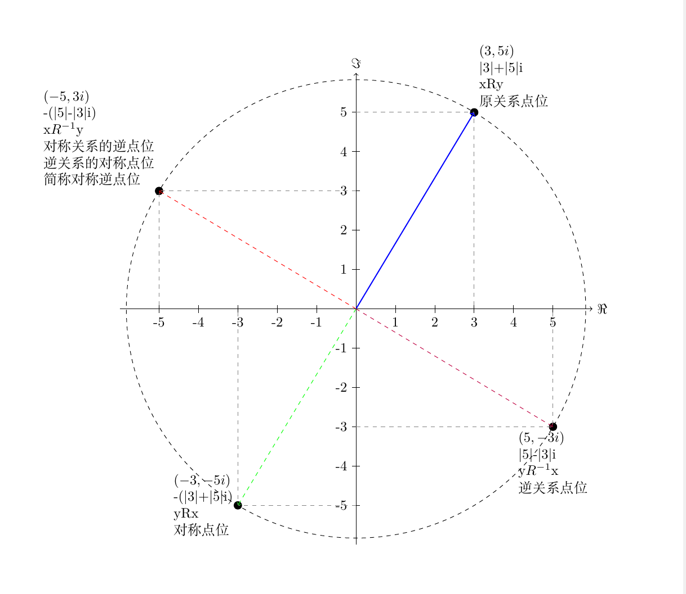

基于关系数据库的用户关系的设计 

## 用户关系在社交应用中普遍存在

用户关系几乎是所有社交应用中必不可少的一个模块。
比如 关注、拉黑、好友、访客、喜欢、举报、陌生人等等。

具体会分以下三类:
| 编号 |分类  | 具体|
|---|---|---|
|1| 单向关系 | 如我看过了谁，我拉黑了谁等等|
|2| 单向关系叠加逆关系 | 如我关注了谁，以及谁关注了我，两种关系。|
|3| 双向对称关系 | 我是谁的好友，那么谁也是我的好友。|

(注: 在关于好友的定义上，不同的业务会有一些不同的定义，有一些应用相互关注了，就是好友，其中一方解除了后，仍然会在另外一方的好友列表里面， 而另外一些应用则是 发送一个好友请求，如果通过后，则建立好友关系，如果一方删除后， 就不会在另外一方的好友列表中，这里的双向对称关系是指后一种)

关系似乎也是一个不起眼的功能，在逻辑上 关系的设计是简单的， 
可以直接对应到一张单表的crud,表的内容只需要 (关系左侧，关系类型，关系右侧,其他关系属性) 即可。 所有的业务操作均可转换为简单的数据库查询操作。 

## 相对于用户规模大的应用，用户关系通常需要分库分表

然而关系的容量R最大值平方于用户量U。当有U=n个用户的时候，一个关系的最大容量max(Rcount)是n2,当U=10K时，关系为 max(Rcount)=100M。当然这是满载时的关系数量，并不是每一个人都会和其他的所有人建立关系。
但即使采用比较乐观的估计模型，用户关系仅限于一个常数量p，当用户量为 U=1M时，用户关系数量也至少Rcount=pM。

如同其他的大数据量应用一样，如果单表数据太大而不分表，在逻辑上查找一个数据，都需要该表的所有数据参与运算，即使有索引的帮助，
也会因为索引膨胀而影响效率。像mysql 的单表记录条数 超过3M的时候，索引树的深度会超过3层，性能会急剧下降。
当一个应用的用户规模U>=1M, 平均每人关系数p>=3时，采用分库分表将存储和查询计算量分摊到多个硬件上是势在必行的事情。
(这是比较容易达到的，毕竟有很多那种系统生成的关系，比如会对新用户产生一些人工记录)

## 分库分表带来的问题
我们假定现在有一个叫关注的关系R， aR关注b 表示 用户a关注了用户b。在表中，以元组 (a,关注,b) 表示。

假如分表键是a，分表路由是按照个位划分的十分表。当想查询a的关注列表的时候，一切都很顺利，所有的记录都在用户a所在的分表内（目前先假定a的关注列表远小于单表容量），但是当我们想查询 谁关注a的时候，就出问题了，由于查询中没有分片路由键，将会引发全部分表的查询。效率将会大大下降。

relp0
|leftid|relp|rightid|
|---|---|---|
|a0|关注|b0|
|a0|关注|b1|
|b0|关注|c2|

relp1
|leftid|relp|rightid|
|---|---|---|
|b1|关注|b0|
|c1|关注|b1|
|c1|关注|c1|

relp2
|leftid|relp|rightid|
|---|---|---|
|a2|关注|b0|
|a2|关注|b1|
|b2|关注|c1|

当我们只按照 关系的一侧进行分库时。查询条件带着其他侧条件的时候，就可能会引起全部分表的查询。
当按照关系的两要素进行分表时，查询条件带着没有带齐两个要素时，也很难计算涉及的分表，也会引发部分分表或者全表查询。如上表格，查询谁关注了b1时，需要从3个表中查找数据。

更进一步的，有一些需求涉及到对关系属性的增删查改，并涉及到排序和分页，这在分表的情况下，解决方案并非那么直观，幸好有现成的解决方案 (具体参考 shardingsphere的归并引擎https://shardingsphere.apache.org/document/4.1.0/cn/features/sharding/principle/merge/ )，但性能上还是需要谨慎考虑，小心规划的， **因为跨表合并数据进行排序分页之类的，需要将数据取到本地来实现，这涉及到远程数据传输和运算，远远不及在数据库本地实例中完成快速** 。

在解决谁关注a这个问题的时候， 很多常用的做法是再一张冗余表来，将(a,b) 存为(b,a)。从而可以利用上分片键而提升查询效率。本项目将会深入探讨关系的本质，从中得到接口规范简洁性能可接受的，基于关系型数据库下的实现方案。

### 小结:
1. 分库分表下，查询条件中没有分片路由键的时候，会引发全部分表查询，性能低下。
2. 分页或者排序的情况下，会引发更严重性能问题，哪怕是底层分库分表中间件提供了功能强大的结果归并引擎。
3. 本项目的解决方案通过空间换取时间，在数据冗余和查询效率中取得均衡，但使用接口简洁规范化，

## 理解关系的本质
### 关于关系的数学定义    
1. 关系定义: 本设计的关系限定为 会员集合M上的二元关系R， 也即序对集合 <x,y> &isin; R &hArr; xRy ，其中 x &isin; M ,y &isin; M;
    * 比如关注关系， 就是一个序对集合<x,y> &isin; R关注 或记为 xR关注y ，表示 x关注y。
    * 好友关系也是一个序对集合 <x,y> ∈ R好友 或记为xR好友y，表示 x 好友 y；

2. 逆关系: R 是集合M上的关系。则把 R-1 定义为 {<y,x>|<x,y>&isin; R},称为关系R的逆关系。 逆关系的逆关系是 原关系: R= （R-1）-1;
    * 比如 xR关注y 的逆关系 R关注-1 为 {<y,x>|<x,y> &isin; R}, 如果把 R关注-1 命名为 别名 R被关注，也不改变其本质。 对逆关系再求逆，则可以得到原关系。 比如 a关注b 的逆关系是 b被关注于a， b被关注于a 的逆关系是 a关注b。
    * 逆关系相当于把 关系的左右侧做了交换的冗余。如果规定只能对关系的一侧进行索引，那么没有逆运算的情况下，知道关系的右侧，找出这个关系进行运算的话， 需要遍历关系右侧的集合才能定位到该关系， 引入逆运算后，可以在提供同等功能的情况下，不需要遍历。
    * 在本文中，正关系和原关系这个等价术语 偶尔会交叉适用，他们是相对逆关系而言的。
3. 对称关系: 对于集合M中每个x和y，若xRy，则yRx，称R是对称的，即M上关系R是对称的 。
    * 比如 对于 R好友 ， 若对于任意的x和y， 如果 xR好友y， 则yR好友x 也存在， 则称 R好友 是对称的(或者说具有对称性质)。
4. 逆关系和对称关系的主要区别:
    * 逆关系 如果不是不动点之类的关系，那么逆关系是不同的关系类型。比如 R父母 的逆关系 R-1孩子，<a,b> &isin; R父母  ,<b,a> &isin; R-1孩子。  也即是说 a是b的父母， b是a的孩子， 两个关系是不同的。
    * 对称 是关系集合的一个特质，而不是一个新的关系类型。对称关系中的一个关系点一定存在这对称点，且仍然在这个关系集合中。可以理解为镜面对称，大小什么的都一样，就是位置不一样。比如R兄弟，对于任意的<a,b> &isin; R兄弟  必有 <b,a> &isin; R兄弟，那么关系R是对称关系。 
    * 对于集合M上的二元关系R，如果R求逆后的值仍然在R中，（与不动点类似），那么必然对称。因为 对于所有的<a,b> &isin;R,都存在<b,a> &isin;R-1,并且逆元素也存在于R中:<b,a> &isin;R。所以完美符合对称的定义。

### 进一步规范化的推导
让我们看一下下面的表格

| xRy |  |  yRx |
|---|---|---|
|   |  &nbsp; |   |
|  xR-1y |   | yR-1x   |

我们会发现几个特点
1. xRy 与 yRx是对称点 xR-1y 与 yR-1x是对称点。
2. xRy 与 yR-1x 是逆关系点，  yRx 与xR-1y 也是逆关系点。

那么类似 xRy与xR-1y 或者yRx与 yR-1x 中间有什么关联呢?

描述一个关系需要两个维度的变量，我们用复平面的一个点来描述一个关系的点时，会发现一些奇妙的特性。

我们进一步做一个变换与推导，会看的更清楚一些。

| 关系名称 | 关系表达  | 操作 顺时针转   | 点表达式  |  结果  | 规范化  | 说明   |存储模式|
|---|---|---|---|---|---|---|---|
| 原关系点  | xRy | 0 &deg;  | (x+yi)*(-i)0  | x+yi  | &verbar; x &verbar; + i*&verbar; y &verbar;    |   | <x,R,y>  |
| 逆关系点  | yR-1x  |  90 &deg;  | (x+yi)*(-i)1  |   y-xi | &verbar; y &verbar;+(-i)* &verbar; x &verbar;   | -i 可以解释为 逆操作  | <y,R-1,x>  |
| 对称关系点  | yRx   | 180 &deg;   |  (x+yi)*(-i)2 |  -(x+yi) | -(&verbar; x &verbar; + i*&verbar; y &verbar;)  |  外层负号可以解释为 将虚实两部调换 |  <y,R,x> |
| 对称关系的 逆关系点  | xR-1y  | 270 &deg;   |  (x+yi)*(-i)3 | -y+xi  |  -(&verbar; y &verbar;+(-i)* &verbar; x &verbar;) | -i 可以解释为 逆操作 外层负号可以解释为 将虚实两部调换  | <x,R-1,y>  |

由于 关系的两边并不一定是数值，有可能是字符串，或者其他的形式， 虽然也可以通过编码映射的方式转换为数值，但这可能会改变关系两边的含义。通过形式推导可知，改变关系两边的值含义不影响最终表达形式。关系两边的值不参与计算。(这是因为旋转的角度是90°的原因，如果旋转的角度不是90°，那关系两边会参与计算)。

从图上可以看出，根据对称性，但我们知道任意一个点的时候，都可以推导出另外三个点的位置。他们都在一个圆上。

### 小结:
1. 每一个点都会有其余三个旋转对称点位，他们都在复平面的同一个圆上，平均地将地该圆分成四分，当我们知道任意一个点时，可以计算出另外三个点的位置。
2. 从规范化的推导模式中可以看出，由于关系的左侧与关系的右侧定义域相同，所以，只需要将关系R与关系R-1区分编码，便可统一在一个表内。
3. 关系模式与存储模式之间的并不一一对应，可以通过符号的语义进行映射而得到对应关系。

## 设计
### 思路
**要想解决数据量过大的问题，我们可以通过分库分表来解决， 但是水平分库分表带来的逻辑割裂问题，导致了查询表的受限。在不引起全量表扫描的情况下，通过把该点的其他部分冗余映射到同一张表中，从而达到目的**。

### 表存储结构

relpDefine
|列名|类型|解释|
|---|---|---|
|id| long |记录id|
|appId|int|哪一个app|
|appName|varchar(20)|app名称,助记|
|relpTableName|varchar(20)|关系表名称，默认relp|
|relpCode|int|关系代码值，只需要显示正关系即可|
|relpName|varchar(20)|关系名称|
|description|text|关系描述|
|route|varchar(128)|分片键，默认为空，不分|
|status|int|状态 0未启用，1 启用|
|md5sum|varchar(32)|上一次有效的，md5校验码，正常启动后， 该值是生产在用的，如果启动后有变更，则计算的值跟在用值会不一样。需要进行更新|
|createTime|timestamp|创建时间|
|updateTime|timestamp|更新时间|
 

relp
|列名|类型|解释|
|---|---|---|
|id|long|记录id|
|appId|int|是为了支持多业务而做的区分|
|leftId| 自定义 |关系或者逆关系左侧的id |
|relpCode | int | 关系代码，用来定义关系的。 逆关系为相应的负数。|
|rightId| | 自定义| 关系或者逆关系右侧的id |
|routeKey | string | 考虑到即使按照用户进行划分之后，表数据仍然很庞大，像一些网红或者明星的粉丝，因此还可以再定义一个routeKey进行更进一步的细分，比如按照年月。 |
| info|string | 存储额外的信息。 |
|reverseId | long| 逆关系的id |
|symmetryId | long|对称关系的id |
|symmetryReverseId | long|对称逆关系id |
|createTime|timestamp|创建时间|
|updateTime|timestamp|更新时间|

在存储上可按照(appId,leftId,|relationshipCode|,routeKey)进行水平切割。
其中，appId,leftId是必须的，其余可选。

###  主要接口
#### 创建

int createRel(appId,leftId,relpCode,rightId,routeKey,info,relpMode,createMode)   
其中appId,leftId,relationshipCode,rightId,routeKey,info含义见如上表。

1. relpMode 指明了创建一个关系的时候，创建哪些点位， 可以将一个关系视为四个点任意组合的集合

|枚举名称|枚举值|原关系点位|逆关系点位|对称关系点位|对称逆关系点位|
|---|---|---|---|---|---|
| CUR:CURRENT 			|1|1 |0 | 0|0|
| REV:REVERSE 			|2|0 |1 | 0|0|
| SYM:SYMMETRY  			|4|0 |0 | 1|0|
| SYMREV:SYMMETRYREVERSE |8|0 |0 | 0|1|
| CUR_REV	 			|3|1 |1 | 0|0|
| CUR_SYM 				|5|1 |0 | 1|0|
| CUR_SYMREV				|9|1 |0 | 0|1|
| REV_SYM				|6|0 |1 | 1|0|
| REV_SYMREV				|10|0 |1 | 0|1|
| SYM_SYMREV             |12|0 |0 | 1|1|
| CUR_REV_SYM			|7|1 |1 | 1|0|
| CUR_REV_SYMREV			|11|1 |1 | 0|1|
| CUR_SYM_SYMREV 		|13|1 |0 | 1|1|
| REV_SYM_SYMREV	 		|14|0 |1 | 1|1|
| FULL					|15|1 |1 | 1|1|

2. createMode 定制创建时的行为 

|mode|说明|
|---|---|
|PROTECT|先检查需要写的点位，如果存在,则不做操作|
|COMPLETE|先检查需要写的点位，如果有缺失的，则补全|
|FORCE|不检查直接写，是否成功看数据库的反馈|

###  查询 
采用builder模式 来构造灵活多变的查询语句。 暂略。

## 常见场景及对策

| 编号 | 场景  |  对策|
|---|---|---|
|1| 单向关系| 模式为 xRy, 存储为<x,R,y>，分片键为存储模式中关系的左侧x，即可将数据进行水平切片。 有一些场景可能会比较特殊一些，也是单向关系,但只是逆关系， 比如 机器人选出一些用户 去踩别人主页， 踩的用户可以看到这个关系， 但是踩人的用户看不到这个关系,这种情况下可以采用模式为yR-1x 存储为<y,R-1,x> ， 分片键为逆关系的左侧y |
|2| 单向叠加逆关系 |xRy, yR-1x, 存储模式<x,R,y> <y,R-1,x> ,分分片键为 关系的左侧x或者逆关系的左侧y|
|3| 双向对称关系 | xRy,yRx   <x,R,y>  <y,R,x>  分片键为关系左侧 |
|4|复合关系|所有的需求都可以通过组合四种关系xRy ,yR-1x,yRx, xR-1y 进行冗余|

### 具体的需求覆盖

####  用户访问关系

* 需求: 我访问过谁，谁访问过我  
* 方法: 定义一个访问关系(关系值假设是1)。以CURR_REV模式创建一个访问关系，因此一次a访问b的行为会产生两条记录。
(a,1,b),(b,-1,a)。
当需要查询a访问过谁时， 过滤条件为  leftid = a的id, relpcode=1,即可得到目标数据集。
当要查询谁访问过a时， 过滤条件为  leftid = a的id, relpcode=-1,即可得到目标数据集。
具体限制比如分页，排序等，可以根据需要来。 

#### 机器访问关系
* 需求: 机器会产生一些用户的访问， 被访问人可以看到这个访问， 但是访问人看不到这个访问。
* 方法: 定义一个访问关系(关系值假设是2)，以REV模式创建一个访问关系，因此一次a访问b的行为会产生一条记录。
  (b,-2,a)
当要查询谁访问过a时， 过滤条件为  leftid = a的id, relpcode=-2,即可得到目标数据集。

#### 谁访问过我(含机器访问和用户)
* 需求: 机器会产生一些用户的访问， 被访问人可以看到这个访问， 但是访问人看不到这个关系。
正常的用户访问的时候，访问人和被访问人都可以看到这个访问。
因此，被访问人可以看到正常用户+机器人的访问记录。 而访问人看到只能看到自己的访问记录， 而而看不到机器人产生的访问记录。
* 方法:  定义一个访问关系(关系值假设是3)，机器人访问时，以REV模式创建一个访问关系，因此一次a访问b的行为会产生一条记录。  (b,-3,a)。
正常人访问的时， 以CURR_REV模式创建一个访问关系，因此一次a访问b的行为会产生两条记录。
(a,3,b),(b,-3,a)。 

当需要查询 a访问过谁时，过滤条件为  leftid = a的id, relpcode=3,即可得到目标数据集。
当需要查询 谁访问过a时，过滤条件为  leftid = a的id, relpcode=-3,即可得到目标数据集。

#### 关注升级好友关系
* 需求: a关注b后，b如果关注了a，则升级为好友关系。（好友可以发起会话，关注不行）
* 方法:  定义一个关注关系(关系值假设是4)，当a关注b的时候，以CURR_REV模式创建一个关注关系， 此刻会产生两条记录(a,4,b),(b,-4,a)，之后，当b又关注a时， 还是以CURR_REV模式创建一个关注关系， 此刻会产生一条记录(b,4,a),(a,-4,b),同时，两条记录的 symmetryid会填上值。(通常这类场景都会有我关注谁，谁关注我的问题。 所以一般都需要创建原关系和逆关系。)
此时当需要查询a的好友列表时，有两种方法，
方法一: 过滤条件为 leftid=a的id，relpcode=4，symmetryId is not null 即可。
方法二: 不使用symmteryId, 过滤条件为 leftId=a的id，relpcode in (4,-4),group by leftid,rightid, having sum(relpCode)=0;

